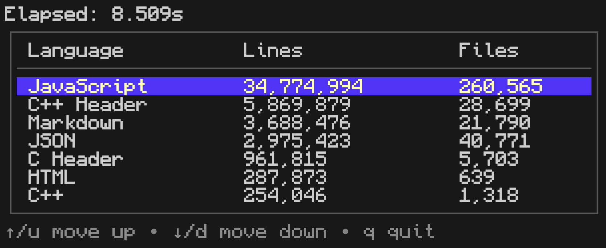

# Ube


Ube (ooh-bay) is a program that displays statistics about your code. Ube will show the number of files, and total lines within those files grouped by language.



## Table of Contents
- [Features](#features)
- [Installation](#installation)
   - [macOS](#macos)
   - [Linux](#linux)
   - [Windows](#windows)
- [Usage](#usage)
- [Contributing](#contributing)
- [License](#license)

## Features <a name="features"></a>
- Ube has a huge range of languages, supporting over **220** language extensions.
- It's **accurate**, and **consistent** as it counts the number of newline characters `/n` present in a specified path. This ensures consistency across different platforms and text editors.
- The code statistics are displayed in a **clean**, **easy-to-read** format leveraging the following libraries from [Charm](https://github.com/charmbracelet):
    - [Bubble Tea](https://github.com/charmbracelet/bubbletea) - A powerful little TUI framework
    - [Bubbles](https://github.com/charmbracelet/bubbles) - TUI components for Bubble Tea
    - [Log](https://github.com/charmbracelet/log) - A minimal, colorful Go logging library

## Installation <a name="installation"></a>

### macOS <a name="macos"></a>
1. Download the appropriate release archive for your platform from the [Releases](https://github.com/ramirezfernando/cloc-tool/releases/tag/v1.0.1) page:
   - For Intel-based Macs: [cloc-tool_1.0.1_darwin_amd64.tar.gz](https://github.com/ramirezfernando/cloc-tool/releases/download/v1.0.1/cloc-tool_1.0.1_darwin_amd64.tar.gz)
   - For Apple Silicon Macs: [cloc-tool_1.0.1_darwin_arm64.tar.gz](https://github.com/ramirezfernando/cloc-tool/releases/download/v1.0.1/cloc-tool_1.0.1_darwin_arm64.tar.gz)

2. Extract the archive from your downloads folder using the following command in your terminal:
    ```bash
    $ tar -xzf ~/Downloads/cloc-tool_1.0.1_darwin_amd64.tar.gz # or cloc-tool_1.0.1_darwin_arm64.tar.gz
    ```
3. Move the extracted binary to a directory in your PATH for convenient access from any directory:
    ```bash
    $ mv cloc-tool /usr/local/bin/cloc
    ```
4. Verify the installation (might have to allow in settings):
    ```
    $ cloc
    ```

### Linux <a name="linux"></a>
1. Download the appropriate release archive for your platform from the [Releases](https://github.com/ramirezfernando/cloc-tool/releases/tag/v1.0.1) page:
    - For 32-bit systems: [cloc-tool_1.0.1_linux_386.tar.gz](https://github.com/ramirezfernando/cloc-tool/releases/download/v1.0.1/cloc-tool_1.0.1_linux_386.tar.gz)
    - For 64-bit systems: [cloc-tool_1.0.1_linux_amd64.tar.gz](https://github.com/ramirezfernando/cloc-tool/releases/download/v1.0.1/cloc-tool_1.0.1_linux_amd64.tar.gz)
    - For ARM 64-bit systems: [cloc-tool_1.0.1_linux_arm64.tar.gz](https://github.com/ramirezfernando/cloc-tool/releases/download/v1.0.1/cloc-tool_1.0.1_linux_arm64.tar.gz)
2. Extract the archive from your downloads folder using the following command in your terminal:
    ```bash
    $ tar -xzf ~/Downloads/cloc-tool_1.0.1_linux_386.tar.gz
    ```
3. Move the extracted binary to a directory in your PATH for convenient access from any directory:
    ```bash
    $ sudo mv cloc-tool /usr/local/bin/cloc
    ```
4. Set the correct permissions for the binary:
    ```bash
    $ sudo chmod +x /usr/local/bin/cloc
    ```
5. Verify the installation:
    ```bash
    $ cloc
    ```

### Windows <a name="windows"></a>
1. Download the appropriate release archive for your platform from the [Releases](https://github.com/ramirezfernando/cloc-tool/releases/tag/v1.0.1) page:
    - For 32-bit systems: [cloc-tool_1.0.1_windows_386.tar.gz](https://github.com/ramirezfernando/cloc-tool/releases/download/v1.0.1/cloc-tool_1.0.1_windows_386.tar.gz)
    - For 64-bit systems: [cloc-tool_1.0.1_windows_amd64.tar.gz](https://github.com/ramirezfernando/cloc-tool/releases/download/v1.0.1/cloc-tool_1.0.1_windows_amd64.tar.gz)
    - For ARM 64-bit systems: [cloc-tool_1.0.1_windows_arm64.tar.gz](https://github.com/ramirezfernando/cloc-tool/releases/download/v1.0.1/cloc-tool_1.0.1_windows_arm64.tar.gz)
2. Extract the archive from your downloads folder using a tool like 7-Zip or WinRAR.
3. Move the extracted binary (cloc-tool.exe) to a directory included in your system's PATH environment variable for convenient access, and rename it to cloc.exe. Alternatively, you can run the tool from its extracted location.
4. Verify the installation:
    ```
    $ cloc
    ```

## Usage <a name="usage"></a>
```bash
$ cloc ./your/path
```

## Contributing <a name="contributing"></a>
Contributions are welcome! Please check the [Contributing Guidelines](CONTRIBUTING.md) for a few helpful tips!

## License <a name="license"></a>
This project is licensed under the [MIT License](LICENSE).
